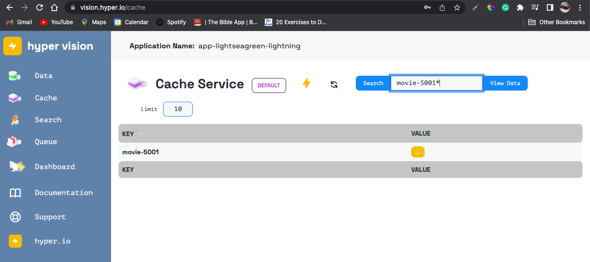
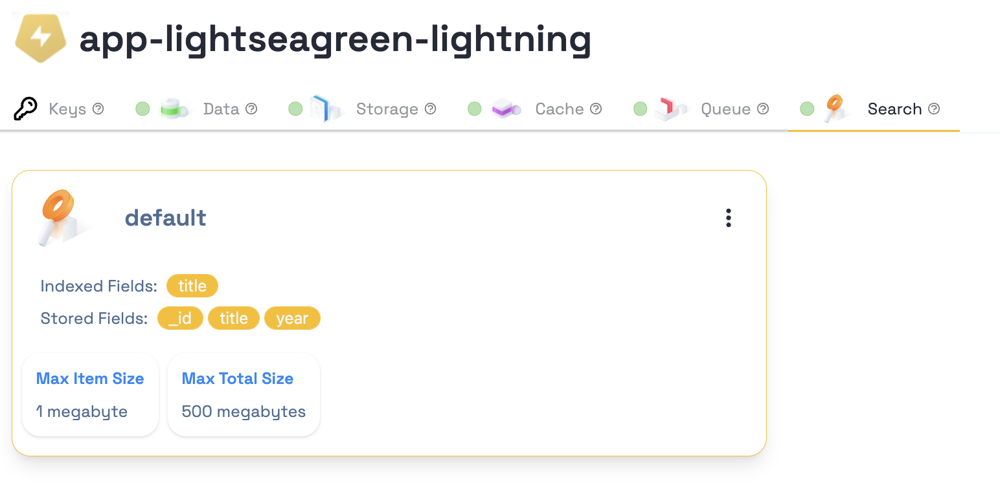

<h1 align="center">🐍 hyper-connect 🐍</h1>
<p align="center">
<code>hyper-connect</code> is the python SDK package for <a href="https://hyper.io">hyper</a>.
</p>
<p align="center">
Official hyper <a href="https://docs.hyper.io">documentation</a>.
</p>

- [Install](#install)
- [Usage](#usage)
- [Services and Actions](#services-and-actions)
- [hyper vision 😎](#hyper-vision-😎)
- [Types and type checking](#types-and-type-checking)
- [Examples](#examples)
- [Synchronous and asynchronous support](#synchronous-and-asynchronous-support)
- [Async examples](#async-examples)
- [Contributing](#contributing)
- [License](#license)
- [Code of Conduct](#code-of-conduct)
- [Linting](#linting)
- [Tests](#tests)
- [Tag and Release](#tag-and-release)
- [Build](#build)
- [Publishing to TestPyPI](#publishing-to-testpypi)
- [Publishing to PyPI](#publishing-to-pypi)

## Install

The following command will install the latest version of the `hyper-connect` module and its dependencies from the Python Packaging Index (PyPI):

```
pip install hyper-connect
```

## Usage

`hyper-connect` wraps a hyper app's REST API, generating a short-lived JWT using a [connection string](https://docs.hyper.io/app-keys) from one of your hyper app's app keys.

`hyper-connect` supports both synchronous and asynchronous calls.

Once you've created an environment variable named `HYPER` with the value of a connection string, you're ready to make a call to the `connect` function which returns a `Hyper` object:


```py
from hyper_connect import connect
from hyper_connect.types import Hyper
from dotenv import dotenv_values
from typing import Dict

config = dotenv_values("./.env")

connection_string: str = str(config["HYPER"])
hyper: Hyper = connect(connection_string)

movie: Dict = {
    "_id": "movie-4000",
    "type": "movie",
    "title": "Back to the Future",
    "year": "1985",
}

result = hyper.data.add(movie)
print("hyper.data.add result --> ", result)
# hyper.data.add result -->  {'id': 'movie-4000', 'ok': True, 'status': 201}
```

## Services and Actions

hyper is a suite of service apis, with hyper connect you can specify the API you want to connect with and the action you want to perform.
hyper.[service].[action] - with each service there are a different set of actions to call. This table breaks down the service and action with description of the action.

### data

| Service | Action | Description                                                         |
| ------- | ------ | ------------------------------------------------------------------- |
| data    | add    | creates a json document in the hyper data store                     |
| data    | list   | lists the documents given a start,stop,limit range                  |
| data    | get    | retrieves a document by id                                          |
| data    | update | updates a given document by id                                      |
| data    | remove | removes a document from the store                                   |
| data    | query  | queries the store for a set of documents based on selector criteria |
| data    | index  | creates an index for the data store                                 |
| data    | bulk   | inserts, updates, and removed document via a batch of documents     |

### cache

| Service | Action | Description                                                         |
| ------- | ------ | ------------------------------------------------------------------- |
| cache   | add    | creates a json document in the hyper cache store with a key         |
| cache   | get    | retrieves a document by key                                         |
| cache   | set    | sets a given document by key                                        |
| cache   | remove | removes a document from the cache                                   |
| cache   | query  | queries the cache for a set of documents based on a pattern matcher |

### search

| Service | Action | Description                                       |
| ------- | ------ | ------------------------------------------------- |
| search  | add    | indexes a json document in the hyper search index |
| search  | get    | retrieves a document from index                   |
| search  | update | updates a document in the hyper search index      |
| search  | remove | removes a document from the index                 |
| search  | query  | searches index by text                            |
| search  | load   | loads a batch of documents                        |

### storage

| Service | Action   | Description                              |
| ------- | -------- | ---------------------------------------- |
| storage | upload   | adds object/file to hyper storage bucket |
| storage | download | retrieves a object/file from bucket      |
| storage | remove   | removes a object/file from the bucket    |

### queue

| Service | Action  | Description                                                |
| ------- | ------- | ---------------------------------------------------------- |
| queue   | enqueue | posts object to queue                                      |
| queue   | errors  | gets list of errors occured with queue                     |
| queue   | queued  | gets list of objects that are queued and ready to be sent. |


## hyper vision 😎

[hyper vision](https://docs.hyper.io/hyper-vision) is a UI dev tool to browse hyper cloud data, cache, search, etc. via an app key's connection string.  It is available at https://vision.hyper.io/.




## Types and type checking

Common types you'll encounter include `HYPER`, `ListOptions`, `QueryOptions`, and `SearchQueryOptions`.

```py
from hyper_connect import connect
from hyper_connect.types import Hyper, ListOptions, QueryOptions, SearchQueryOptions
```

The SDK performs runtime type checking on the arguments passed into methods and functions, as well as, the return value.

Passing incorrect types will cause a `TypeError` to be raised:


```py
def data_list_bad_keys_sync(self):
    options: ListOptions = {
        "startkey": None,
        "limit": None,
        "endkey": None,
        "keys": 6,
        "descending": None,
    }

    try:
        result = hyper.data.list(options)
    except TypeError as err:
        print('data_list_bad_keys_sync TypeError -> ', err)
        # data_list_bad_keys_sync TypeError -> type of dict item "params" for argument "req_params" must be one of (hyper_connect.types._types.ListOptions, hyper_connect.types._types.QueryOptions, Dict[str, str], NoneType); got dict instead

```

Some keys within `ListOptions`, `QueryOptions`, and `SearchQueryOptions` are optional.  For example both of the following typed Dictionaries are valid types:

```py
valid_data_list_options: ListOptions = {
    "startkey": "book-000105",
    "limit": None,
    "endkey": "book-000106",
    "keys": None,
    "descending": None,
}

also_valid_options: ListOptions = {
    "startkey": "book-000105",
    "endkey": "book-000106"
}
```


## Examples

See **[examples.py](https://github.com/hyper63/hyper-connect-py/blob/main/examples.py)**

## Synchronous and asynchronous support

`hyper_connect` supports both synchronous and asynchronous methods for each service type (data, cache, storage, etc.).  It's easy to distinguish between the two.  Synchronous method names will **not** end in `_async`.

    ```py
    result = hyper.data.add(movie)
    ```

While asynchronous methods end in `_async`:

    ```py
    result = await hyper.data.add_async(movie)
    ```

> Async can be a little tricky.  Here are a couple of good resources to help avoid the pitfalls 😵‍💫:
> [How to Create an Async API Call with asyncio](https://www.youtube.com/watch?v=t0JXiljpNRo) and
> [Common Mistakes Using Python3 asyncio](https://xinhuang.github.io/posts/2017-07-31-common-mistakes-using-python3-asyncio.html)


- You must use the `async` and `await` syntax:

    ```py
    async def data_add():

        movie: Dict = {
            "_id": "movie-5000",
            "type": "movie",
            "title": "Back to the Future 2",
            "year": "1987",
        }

        result: IdResult = await hyper.data.add_async(movie)
        print("hyper.data.add_async result --> ", result)
        # hyper.data.add_async result -->  {'id': 'movie-4000', 'ok': True, 'status': 201}
    ```

- To run your asyncronous function, use [`asyncio`](https://docs.python.org/3/library/asyncio.html) which is a library to write concurrent code using the async/await syntax:

    ```py
    from examples_async import data_add
    import asyncio
    asyncio.run(data_add())

    # hyper.data.add result -->  {'id': 'movie-5000', 'ok': True, 'status': 201}
    ```

- Calls to asynchronous methods return JS style promises.  Compose your Hyper services to create complex flows:

    ```py
    async def data_cache_compose():
        movie: Dict = {
            "_id": "movie-5001",
            "type": "movie",
            "title": "Back to the Future 3",
            "year": "1989",
        }

        result = await hyper.data.add_async(movie).then(
            lambda _: hyper.cache.add_async(
                key=movie["_id"], value=movie, ttl="1d"
            )
        )
        print("hyper data and cache add result --> ", result)
        # hyper data and cache add_async result -->  {'ok': True, 'status': 201}
    ```

## Async examples

See **[examples_async.py](https://github.com/hyper63/hyper-connect-py/blob/main/examples_async.py)**

## Contributing

Interested in contributing? Check out the contributing guidelines. Please note that this project is released with a Code of Conduct. By contributing to this project, you agree to abide by its terms.

See [Contributing](./CONTRIBUTING.md).

## License

`hyper_connect` was created by the hyper team. It is licensed under the terms of the Apache 2.0 license.

See [Licence](./LICENCE).

## Code of Conduct
.
See [Code of Conduct](./CONDUCT.md)

### Developer Setup

We prefer you use Gitpod.  Gitpod provides a fully initialized, perfectly set-up developer environmment for the hyper connect SDK.

> We recommend you [install the Gitpod browser extension](https://www.gitpod.io/docs/browser-extension) to make this a one-click operation.

[](https://gitpod.io/#https://github.com/tripott/hyper-connect-py-test)

### Environment Variables

If you plan on running tests, you'll need to create an environment variable named `HYPER`.

```bash
HYPER=cloud://your app key:your app secret--gI1MkcrUqFPMR@cloud.hyper.io/express-quickstart
```

One way to add an environment variable is to use a **.env** file.  Feel free to provide environment variables in a way that makes sense to you.

- Create a **.env** file in the project root.
- Within **.env**, create an environment variable named `HYPER` with a value of your hyper app's [connection string](https://docs.hyper.io/app-keys#nq-connection-string).


## Linting

We use git pre-commit hooks, black, and isort to prettify the code and run static type checking with mypy.   See the **.pre-commit-config.yaml**.

To run these checks, execute the `make lint` command.

## Tests

> Heads up! Integration tests assume a hyper app and services have been created.  See https://docs.hyper.io/applications for details on creating hyper applications and service.

A storage service should have the following setup:



Run the `make test` script to run the unit and integration tests.

## Tag and Release

Bump the semver value within **pyproject.toml**.  Create tag and push tag:

```bash
$ git tag v0.0.3
$ git push --tags
```

Now if you go to the repository on GitHub and navigate to the “Releases” tab, you should see the new tag.

Create a release from the tag in GitHub.

> See https://py-pkgs.org/03-how-to-package-a-python#tagging-a-package-release-with-version-control

## Build

We can easily create an sdist and wheel of a package with poetry using the command `poetry build`.  Both files are created in a directory named **dist/**.  Those two new files are the sdist and wheel for our package.

```bash
$ poetry build
```

> See https://py-pkgs.org/03-how-to-package-a-python#building-your-package

## Publishing to TestPyPI

Do a “dry run” and check that everything works as expected by submitting to TestPyPi first.  `poetry` has a `publish` command, which we can use to do this, however the default behavior is to publish to PyPI. So we need to add TestPyPI to the list of repositories `poetry` knows about using the following command:

```bash
$ poetry config repositories.test-pypi https://test.pypi.org/legacy/
```

To publish to TestPyPI we can use poetry publish (you will be prompted for your username and password for TestPyPI).

```bash
$ poetry publish -r test-pypi
```

Now we should be able to visit our package on TestPyPI: https://test.pypi.org/project/hyper-connect/

We can try installing our package using pip from the command line with the following command:

```bash
$ pip install --index-url https://test.pypi.org/simple/ --extra-index-url https://pypi.org/simple hyper-connect
```

> See https://py-pkgs.org/03-how-to-package-a-python#publishing-to-testpypi


## Publishing to PyPI

If you were able to upload your package to TestPyPI and install it without error, you’re ready to publish your package to PyPI. You can publish to PyPI using the `poetry publish` command without any arguments:

```bash
$ poetry publish
```

Your package will then be available on PyPI (e.g., https://pypi.org/project/pycounts/) and can be installed by anyone using pip:

> See https://py-pkgs.org/03-how-to-package-a-python#publishing-to-pypi

### COMING SOON: Verify Signature

hyper Queue allows you to create a target web hook endpoint to receive jobs, in order to secure that endpoint to only receive jobs from hyper, you can implement a secret, this secret using sha256 to encode a `nounce` timestamp and a signature of the job payload. We created a function on `hyper_connect` to make it easier to implement your own middleware to validate these incoming jobs in a secure way.
